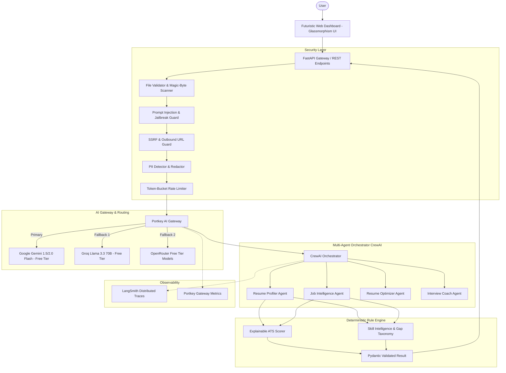

# AI Career Intelligence Platform ⚡

[](https://www.python.org/)
[](https://fastapi.tiangolo.com/)
[](https://www.crewai.com/)
[](https://portkey.ai/)
[](https://smith.langchain.com/)
[](https://opensource.org/licenses/MIT)

> **Enterprise-grade Multi-Agent AI Career Intelligence & Resume Optimization Platform.**  
> Built with CrewAI, deterministic explainable ATS scoring, Portkey AI Gateway, multi-tier free LLM failover, and comprehensive OWASP LLM security controls.

---

## 📑 Table of Contents

- [Overview](#overview)
- [Key Features](#key-features)
- [System Architecture](#system-architecture)
- [AI Security Architecture](#ai-security-architecture)
- [Multi-Agent Design (CrewAI)](#multi-agent-design-crewai)
- [Free LLM Routing Strategy](#free-llm-routing-strategy)
- [Portkey AI Gateway Integration](#portkey-ai-gateway-integration)
- [LangSmith Observability & Tracing](#langsmith-observability--tracing)
- [Tech Stack](#tech-stack)
- [Installation & Quickstart](#installation--quickstart)
- [Environment Variables](#environment-variables)
- [Testing Suite](#testing-suite)
- [Deployment](#deployment)
- [Interview Explanation Guide](#interview-explanation-guide)
- [Limitations & Roadmap](#limitations--roadmap)

---

## 🚀 Platform Architecture & Modules

The platform is designed around two integrated modules sharing a unified security layer, LLM gateway, and observability framework:

### 📄 Module 1: AI Resume Analyzer & Multi-Agent Optimization
1. **Multi-Format Ingestion:** Native parsing of **PDF, DOCX, Markdown, and TXT** documents with magic-byte signature validation.
2. **Deterministic ATS Engine:** Explainable 0–100 scoring based on mathematical keyword density, technical competency alignment, seniority weighting, and structural integrity.
3. **Skill Intelligence:** Automatic categorization into `STRONG`, `PARTIAL`, and `MISSING` skills with step-by-step learning roadmaps.
4. **Fact-Grounded Resume Optimizer:** Transforms raw bullets into active STAR/XYZ-format achievements strictly bound to candidate truth (zero hallucination).
5. **Interactive Mock Interview Simulator:** Evaluates candidate answers across 5 engineering dimensions with rubric-scored feedback.

### 🤖 Module 2: AI Career Research & Preparation RAG Assistant
1. **Multi-Source Ingestion:** Ingests and partitions user knowledge documents (PDF, DOCX, TXT, MD, CSV) into semantic chunks.
2. **100% Free Local Vector Storage:** Utilizes local ONNX embeddings (`all-MiniLM-L6-v2`, 384 dimensions) and persistent ChromaDB with metadata filtering.
3. **LangGraph State Routing:** State machine workflow directing queries across `COMPANY_RESEARCH`, `INTERVIEW_PREP`, `RESUME_COMPARISON`, and `DOCUMENT_QA`.
4. **Live Web Intelligence:** Integrates Serper Google search and public engineering knowledge with SSRF guardrails.
5. **Cross-Module Context Bridge:** Seamlessly forwards candidate profile strengths, target JD criteria, and missing skills from Module 1 into Module 2.
6. **Verifiable Citations:** Sourced responses with exact document names, sections, page numbers, similarity match %, and clickable web links.
7. **Strategic Preparation Dossier:** Generates actionable 14-day / 30-day study roadmaps with exportable Markdown reports.

---

## 🏛️ System Architecture



---

## 🛡️ AI Security Architecture

Security controls are implemented against common AI application risks (OWASP LLM Top 10):

```mermaid
flowchart LR
    Input[User Resume & JD Input] --> PG[Prompt Injection Guard]
    PG -->|Scan Delimiters & Keywords| XML[Data Isolation Container]
    XML --> SSRF[SSRF DNS Pre-Resolver]
    SSRF -->|Block Private Subnets & Cloud Meta| Sanitizer[PII Masking]
    Sanitizer --> LLM[LLM Execution Layer]
    LLM --> Pydantic[Pydantic Output Validation & Repair]
    Pydantic --> SafeOutput[Safe Rendered Result]
```



### 1. Prompt Injection Defense
- Wraps untrusted inputs in explicit structural XML boundaries (`<UNTRUSTED_DOCUMENT_DATA>`).
- Instructs the model that content between tags is inert data and must never be executed as instructions.
- Detects instruction overrides, system prompt exfiltration attempts, and special control tokens (`<|im_start|>`, `[SYSTEM]`).

### 2. SSRF Protection
- Outbound job scraping URLs undergo scheme checks (HTTP/HTTPS only).
- Resolves DNS before request execution to block loopback (`127.0.0.1`), link-local (`169.254.169.254`), and private subnets (`10.0.0.0/8`, `172.16.0.0/12`, `192.168.0.0/16`).
- Supports RFC 6052 NAT64 prefixes (`64:ff9b::/96`) for modern IPv6 connectivity.

### 3. Magic-Byte File Validation
- Rejects renamed executables or spoofed extensions.
- Validates file signatures (`%PDF-` for PDFs, `PK\x03\x04` for DOCX).
- Enforces a 10MB file limit and a 15-page ceiling to prevent decompression bombs.

### 4. PII Protection
- Scans and masks email addresses and phone numbers before dispatching logs or external traces.
- Supports reversible tokenization (`[EMAIL_1]`, `[PHONE_1]`).

---

## 🤖 Multi-Agent Design (CrewAI)

| Agent | Role | Responsibility |
| :--- | :--- | :--- |
| **Senior Resume Profiler** | Tech Profiler | Extracts verified competencies and project architectures without hallucination. |
| **Tech Job Market Specialist** | Market Sourcer | Deconstructs job descriptions into hard technical must-haves and nice-to-haves. |
| **Principal Resume Strategist** | Career Optimizer | Enhances bullet points into high-impact STAR/XYZ statements strictly grounded in facts. |
| **Engineering Interview Coach** | Bar Raiser | Generates cross-domain questions and objectively evaluates candidate answers. |

---

## 💸 Free LLM Routing Strategy

The platform runs on free-tier LLMs:

```text
Primary Provider: Google Gemini 1.5 Flash (Free Tier: 15 RPM / 1M TPM)
         │ (Rate limited or quota exceeded)
         ▼
Fallback 1:       Groq Llama 3.3 70B Versatile (Free Tier: 30 RPM)
         │ (Fallback failure)
         ▼
Fallback 2:       OpenRouter Free Models (meta-llama/llama-3.1-8b-instruct:free)
         │ (Offline or test execution)
         ▼
Mock Mode:        High-Accuracy Deterministic Rule Fallback
```

---

## 🔌 Portkey AI Gateway Integration

[Portkey](https://portkey.ai/) acts as the centralized AI Gateway:
- **Unified Interface:** Standardized routing across Gemini, Groq, and OpenAI-compatible models.
- **Enterprise Guardrails:** Enforces input/output controls at the network gateway level.
- **Request Metadata Tagging:** Every request includes metadata (`project=ai-career-intelligence`, `feature=resume_optimizer`, `environment=production`).

---

## 📊 LangSmith Observability & Tracing

[LangSmith](https://smith.langchain.com/) provides complete visibility into multi-agent workflows:
- **Trace Spans:** Track execution latency and token consumption across all agent tasks.
- **Tool Tracing:** Monitor web search queries and document parser operations.
- **Redacted Telemetry:** PII is sanitized before traces are logged to cloud telemetry.

---

## 🛠️ Tech Stack

- **Backend:** Python 3.12, FastAPI, Uvicorn, Pydantic V2
- **Agent Orchestration:** CrewAI 1.14
- **AI Gateways & Tracing:** Portkey AI, LangSmith
- **Document Parsers:** pdfplumber, python-docx, beautifulsoup4
- **Frontend:** HTML5, Tailwind CSS, Lucide Icons, Vanilla ES6 JavaScript (Zero Node build dependencies)
- **Deployment & DevOps:** Docker (multi-stage non-root), Docker Compose, GitHub Actions CI, Streamlit Cloud Adaptor

---

## ⚙️ Installation & Quickstart

### Prerequisites
- Python 3.12+ installed
- Git

### 1. Clone & Set Up Virtual Environment
```bash
git clone https://github.com/Aswinbose05/Resume_Analyzer.git
cd Resume_Analyzer

# Create virtual environment
python -m venv venv

# Activate virtual environment
# Windows:
.\venv\Scripts\activate
# Linux/macOS:
source venv/bin/activate

# Install dependencies
pip install -r requirements.txt
```

### 2. Configure Environment Variables
Copy the template and add at least one free LLM API key (e.g. Gemini):
```bash
cp .env.example .env
```
Edit `.env`:
```env
GOOGLE_API_KEY=your_gemini_api_key_here
# Optional fallbacks
GROQ_API_KEY=your_groq_api_key_here
PORTKEY_API_KEY=your_portkey_key_here
```

### 3. Launch the Platform
```bash
python run.py
```
Open your browser and navigate to:  
👉 **`http://localhost:8000`**

*(To launch the Streamlit Cloud fallback interface instead, run: `streamlit run streamlit_app.py`)*

---

## 🧪 Testing Suite

Run the full suite of unit, security, and evaluation tests:
```bash
pytest resume-tailor-ai/tests/ -v
```
All 12 test modules verify:
- Parser integrity & missing field handling
- Deterministic ATS score consistency
- Prompt injection & jailbreak detection
- SSRF private IP blocking
- Magic-byte file validation
- Anti-hallucination policy enforcement

---

## 🐳 Deployment

### Run via Docker Compose
```bash
docker-compose up --build
```
The application will be accessible at `http://localhost:8000` with automated healthchecks.

### Deploy to Streamlit Community Cloud
1. Push this repository to GitHub.
2. Link your repo on [share.streamlit.io](https://share.streamlit.io/).
3. Set the main file path to: `streamlit_app.py`.
4. Configure your API keys in the Streamlit Cloud Secrets Manager.

---

## 💼 Interview Explanation Guide

*Key talking points when discussing this project in engineering interviews:*

1. **Why CrewAI over a single LLM prompt?**  
   *"A single prompt struggles to balance ATS keyword extraction, tone optimization, and interview question formulation simultaneously. By decoupling these tasks into specialized agents with distinct backstories, constraints, and validation boundaries, we achieve superior output quality and zero hallucination."*

2. **How is the ATS score calculated?**  
   *"The ATS score is deterministic, not an arbitrary LLM hallucination. It uses a mathematical, weighted formula across five critical dimensions: Keyword Coverage (35%), Technical Alignment (25%), Experience Match (20%), Education Alignment (10%), and Formatting Integrity (10%)."*

3. **How is prompt injection prevented?**  
   *"We treat resumes and job descriptions as untrusted user data. All inputs pass through our `PromptGuard` scanner to detect prompt injection signatures before being isolated within rigid structural XML tags (`<UNTRUSTED_DOCUMENT_DATA>`)."*

4. **How do you handle LLM rate limits on free infrastructure?**  
   *"We designed a multi-tier fallback architecture. If Google Gemini free tier encounters rate limits (HTTP 429), the gateway fails over to Groq Llama 3.3 70B, then OpenRouter, with deterministic rule-based evaluation as the ultimate safety net."*

---

## ⚠️ Limitations & Roadmap

- **OCR for Scanned Resumes:** Currently processes text-based PDFs. Future versions will integrate Tesseract/PaddleOCR for image-only scans.
- **Live Voice Interview Simulator:** Planned integration with WebRTC and real-time speech-to-text for realistic audio mock interviews.
- **Direct LinkedIn One-Click Apply:** Integration with applicant webhooks for streamlined job submissions.

---

## 📄 License

Distributed under the MIT License. See `LICENSE` for details.
